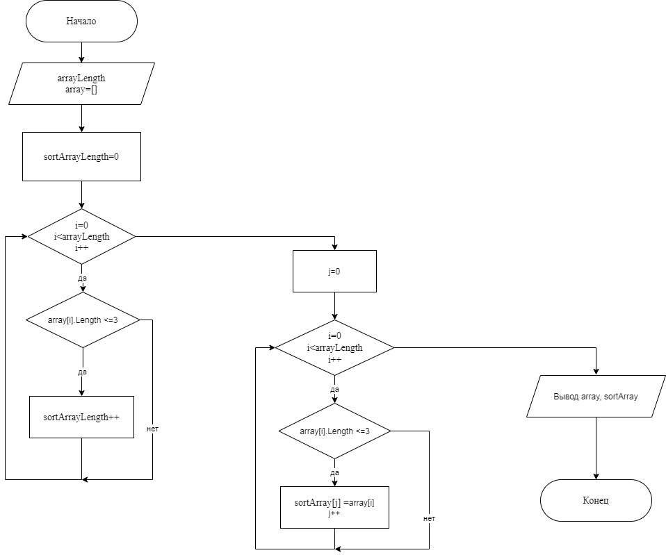

* Запрашиваем у пользователя ввести с клавиатуры размер массива.
* Инициализируем строковый массив, заданной пользователем длинной. 
* В цикле формируем строковый массив с введением каждого элемента пользователем.
* Далее в цикле определяем количество элементов массива длинной <= 3, чтобы определить размер отсортированного массива.
* Инициализируем новый строковый массив, длинной определенной в предыдущем пункте.
* В цикле присваиваем каждому элементу отсортированного массива значение старого массива, длинна которого <=3.
* Выводим оба массива на экран. 

